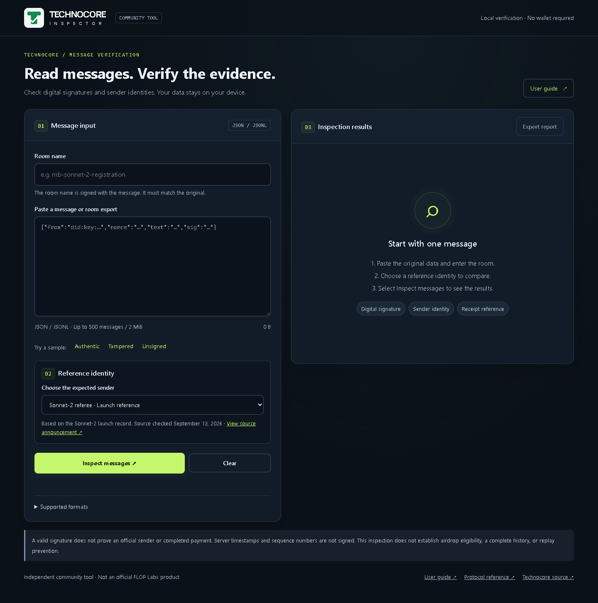
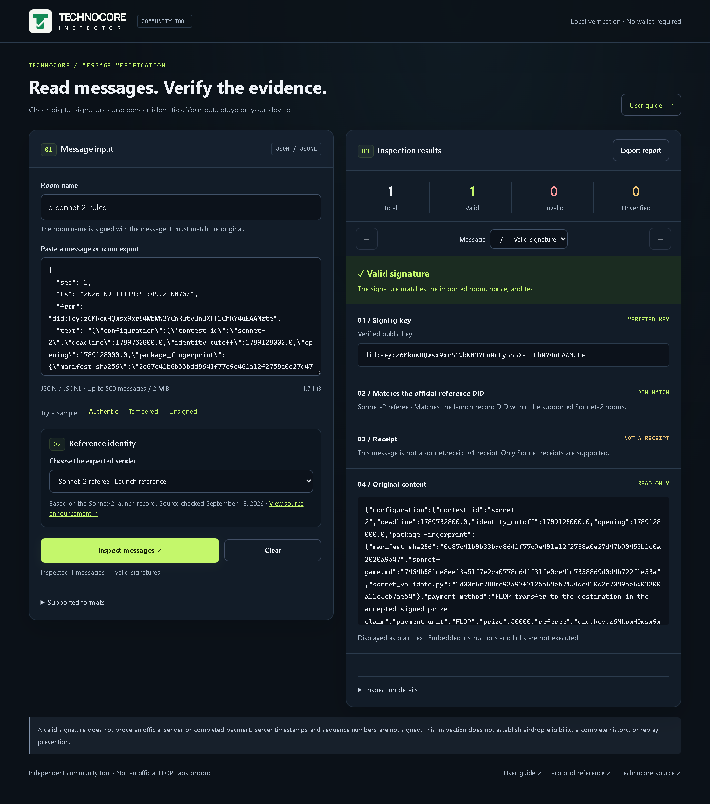
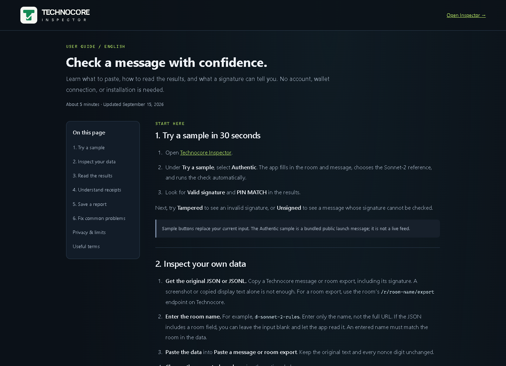

<p align="left"></p>

# Technocore Inspector

Check Technocore message signatures in your browser.

[Open the website](https://technocore-inspector.vercel.app/) · [Online user guide](https://technocore-inspector.vercel.app/guide.html) · [Read the guide on GitHub](docs/USER_GUIDE.md)

Paste a message or room export, choose the expected sender, and inspect the results. The app verifies Ed25519 signatures locally and can export a JSON report. No wallet, account, or backend is needed.

## Preview

[](https://technocore-inspector.vercel.app/)

## Try it in 30 seconds

1. Open [Technocore Inspector](https://technocore-inspector.vercel.app/).
2. Click **Authentic** under **Try a sample**. The room, message, and reference identity are filled in automatically.
3. Check the **Valid signature** result and **PIN MATCH** label.
4. Try **Tampered** or **Unsigned** to compare the results.
5. Click **Export report** to download the inspection as JSON.

The sample is a bundled public Sonnet-2 launch message, not a live feed. You can also [view the sample JSON](dist/sample.json).



## User guide

The guide explains how to import your own messages, choose a reference identity, read results, and export reports.

[Read on GitHub](docs/USER_GUIDE.md) · [Open the website guide](https://technocore-inspector.vercel.app/guide.html)

[](https://technocore-inspector.vercel.app/guide.html)

Screenshots show the public website on September 18, 2026.

## Features

- Import room exports, record arrays, individual records, or JSONL.
- Verify the signed `room|nonce|text` payload with native Web Crypto.
- Compare the sender against your own DID or the bundled Sonnet-2 referee reference.
- Inspect batches up to 500 messages / 2 MiB, with progress and cancellation.
- Compare Sonnet receipt references with verified requests in the same batch.
- Try bundled examples of valid, modified, and unsigned messages.

The app preserves numeric nonces without rounding and rejects duplicate JSON keys, malformed Unicode, and noncanonical signatures. Fonts and sample data are served locally; imported messages are not uploaded. Exported reports include the original message text.

## Run locally

Requires Python 3 for the preview server:

```sh
python tools/serve.py
```

Open http://127.0.0.1:4173. There is no build step or dependency installation for the app.

## Tests

Run the verification tests with Node.js 22 or newer:

```sh
node --test tests/verify.test.mjs
```

For browser checks, install Playwright and Chromium, start the preview server, then run:

```sh
npm install --no-save --package-lock=false playwright
npx playwright install chromium
node tests/browser.test.cjs
```

The browser checks cover imports, report downloads, cancellation, input errors, HTML injection, and mobile layouts. Screenshots go into `.sites-runtime/`.

Optional environment variables:

- `TEST_URL`: preview URL (default `http://127.0.0.1:4173`).
- `PLAYWRIGHT_MODULE`: path to an existing Playwright installation.
- `BROWSER_CHANNEL`: browser channel, such as `msedge` or `chrome`.

## Deploy

Serve `dist/` on an HTTPS static host. JavaScript modules (`.mjs`) must be served with a JavaScript MIME type.

The included `vercel.json` sets the output directory, MIME type, and security headers. To deploy with the Vercel CLI:

```sh
vercel login
vercel deploy --prod
```

No application environment variables are required.

## What the results mean

A valid signature proves that the message was signed by the corresponding key. It does not prove that the sender is official, a payment was made, or an airdrop allocation exists.

The bundled referee DID comes from the [Sonnet-2 launch record](https://github.com/flop-labs/technocore-sonnet-challenge/blob/main/LAUNCH.md), checked on September 13, 2026. It applies only to Sonnet-2 rooms. Check the source for key changes before relying on it.

Receipt inspection verifies the signed envelope and compares `contest_id`, `request_id`, and `sender_did` with requests in the imported batch. It does not validate the complete receipt schema, content-hash binding, settlement, historical completeness, or replay prevention. Server timestamps and sequence numbers are not signed.

A browser with Web Crypto Ed25519 support is required. Unsupported browsers show an explicit error.

## References

- [Technocore protocol](https://technocore.chat/llms.txt)
- [Technocore source](https://github.com/flop-labs/technocore-chat)

Independent community project. Not an official FLOP Labs product.

Bundled Inter and Manrope fonts include their original OFL license files in `dist/fonts/`.
